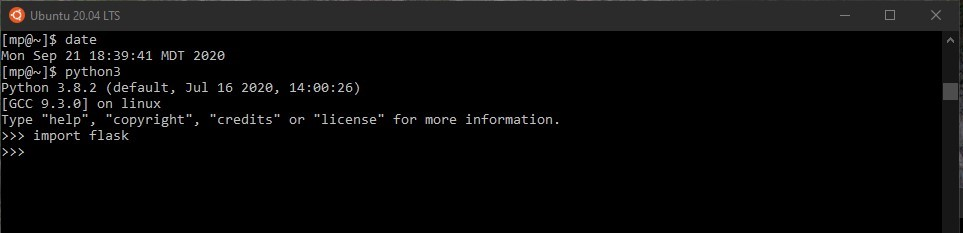
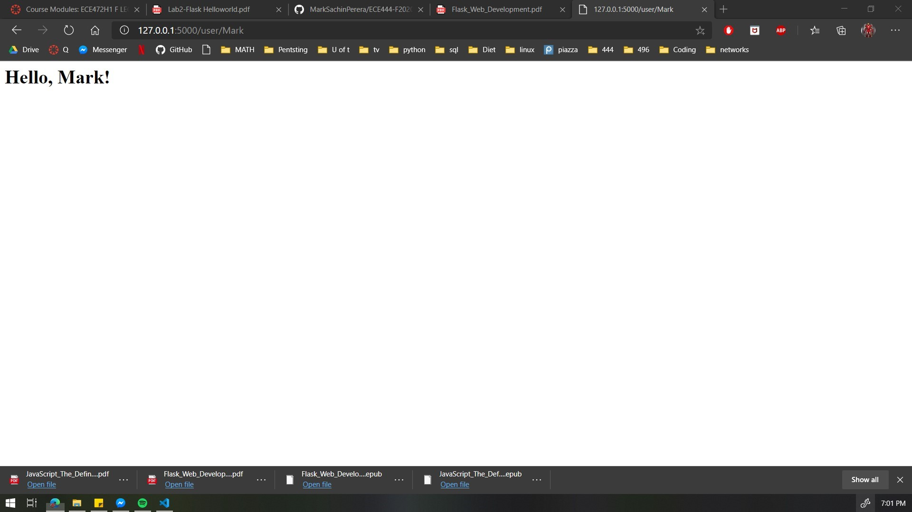

# Mark Perera

> this repo is a clone of https://github.com/miguelgrinberg/flasky

_____________________________________

## Activity 1: Install flask

## Activity 2: Dynamic routing

## Activity 3: What are context globals?

> These are objects that flask has temporarily made globally available for the program to access. This is to minimize clutter. 
